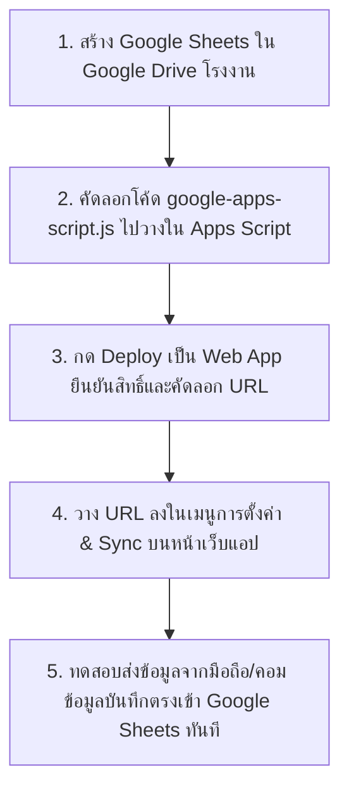

# คู่มือการผูกฐานข้อมูลออนไลน์และการตั้งค่าสิทธิ์การเข้าถึง (Google Sheets & Web App Deployment)

เอกสารนี้สรุปขั้นตอนสำหรับเจ้าหน้าที่และผู้ดูแลระบบในการ **ผูกระบบขึ้นออนไลน์ฟรี (ไม่มีค่าเช่าเซิร์ฟเวอร์)** และ **การจัดสิทธิ์การเข้าถึงสำหรับบุคลากรโรงงาน**

---

## 📌 ขั้นตอนที่ 1: การผูกฐานข้อมูล Google Sheets ขึ้นออนไลน์ (Database Setup)

### ขั้นตอนอย่างละเอียด:

1. **สร้างไฟล์ Google Sheets**:
   - ล็อกอินด้วยบัญชี **Gmail หรือ Google Workspace** ของโรงงาน
   - เปิด [Google Drive](https://drive.google.com) > กด **+ ใหม่ (New)** > **Google ชีต (Google Sheets)**
   - ตั้งชื่อไฟล์ว่า: `ฐานข้อมูลติดตามพลังงาน_สารเคมี_โรงงานซ่อมบำรุง`

2. **เปิดหน้าเขียนสคริปต์ (Apps Script)**:
   - ที่เมนูด้านบนของ Google Sheets ไปที่ **ส่วนขยาย (Extensions)** > **Apps Script**
   - ลบโค้ดเริ่มต้นออกทั้งหมด
   - เปิดไฟล์ [google-apps-script.js](file:///c:/Users/LeCe380/Desktop/eg%20projects/google-apps-script.js) ในโฟลเดอร์โปรเจกต์นี้ คัดลอกโค้ดทั้งหมดนำมาวาง

3. **กด Deploy สคริปต์ขึ้นออนไลน์ (Web App Deployment)**:
   - กดปุ่ม **บันทึก (Save / ไอคอนแผ่นดิสก์)**
   - กดปุ่ม **ทำให้ใช้งานได้ (Deploy)** ที่มุมขวาบน > เลือก **การทำให้ใช้งานได้รายการใหม่ (New Deployment)**
   - คลิกไอคอนรูปฟันเฟือง ⚙️ ข้างคำว่า "เลือกประเภท" > เลือก **เว็บแอป (Web app)**
   - กรอกรายละเอียด:
     - **คำอธิบาย (Description)**: `Energy Tracker API v1`
     - **เรียกใช้ในฐานะ (Execute as)**: `ฉัน (Me - บัญชี Gmail ของโรงงาน)`
     - **ผู้มีสิทธิ์เข้าถึง (Who has access)**: **`ทุกคน (Anyone)`** *(จำเป็นต้องเลือกเป็น 'ทุกคน' เพื่อให้อุปกรณ์มือถือ/PC ของเจ้าหน้าที่สามารถส่งข้อมูลบันทึกเข้า Google Sheets ได้ฟรีโดยไม่ต้องเสียค่าเซิร์ฟเวอร์)*
   - กดปุ่ม **ทำให้ใช้งานได้ (Deploy)**

4. **อนุมัติสิทธิ์ (Authorize Access)**:
   - หน้าจอจะขึ้นปุ่มให้กด **ให้สิทธิ์การเข้าถึง (Authorize access)** > เลือกบัญชี Google ของท่าน
   - หากขึ้นเตือน "Google hasn't verified this app" ให้กด **Advanced (ขั้นสูง)** > กด **Go to Untitled project (unsafe)** > กด **Allow (ยินยอม)**
   - ระบบจะแสดง **URL ของเว็บแอป (Web App URL)** เช่น:
     `https://script.google.com/macros/s/AKfycbx.../exec`
   - คัดลอก URL นี้ไว้

5. **เชื่อมต่อ URL เข้ากับหน้าเว็บแอป**:
   - เปิดหน้าเว็บแอป [index.html](file:///c:/Users/LeCe380/Desktop/eg%20projects/index.html)
   - คลิกแท็บ **"⚙️ การตั้งค่า & Sync"**
   - วาง URL ที่คัดลอกมา ลงในช่อง **Google Apps Script Web App URL**
   - กดปุ่ม **"บันทึก URL การเชื่อมต่อ"**
   - ทดลองกดปุ่ม **"ทดสอบ Sync เข้า Google Sheets"** ระบบจะส่งข้อมูลทดสอบและสร้างแถวหัวตารางภาษาไทยใน Google Sheets ให้อัตโนมัติทันที!

---

## 🔒 ขั้นตอนที่ 2: การตั้งค่าสิทธิ์การเข้าถึงและการควบคุม (Access Control & Permissions)

### 1. สิทธิ์ระดับผู้ดูแลระบบ (Admin / Database Level)
- **สิทธิ์ครอบครอง Google Sheets**: มอบสิทธิ์สิทธิ์การแก้ไขไฟล์ Google Sheets ให้เฉพาะผู้บังคับบัญชา หัวหน้าแผนก หรือแอดมินระบบเท่านั้น
- **ประโยชน์**: เจ้าหน้าที่ผู้ปฏิบัติงานทั่วไปจะ **ไม่จำเป็นต้องเข้าถึงตัวไฟล์ Google Sheets โดยตรง** ช่วยป้องกันการเผลอลบข้อมูล การแก้สูตร หรือตารางเพี้ยนโดยไม่ตั้งใจ

### 2. สิทธิ์ระดับผู้ปฏิบัติงาน (Staff / Users Level)
- **การใช้งานผ่านมือถือ/คอมพิวเตอร์**: เจ้าหน้าที่แต่ละส่วนงาน (ไฟฟ้า, ประปา/สารเคมี, ไอน้ำ&เชื้อเพลิง, คลัง) จะใช้งานผ่านหน้าเว็บแอป (PWA)
- **ระบบบันทึกกำกับชื่อ (Audit Log)**: ทุกครั้งที่มีการกดบันทึก ระบบจะบันทึก **ชื่อ-นามสกุล, ตำแหน่ง/แผนก, วัน-เวลา** กำกับไว้ในตารางย้อนหลังเสมอ ทำให้สามารถตรวจสอบได้ว่าใครเป็นผู้ลงข้อมูลในแต่ละส่วนงาน

---

## 🌐 ขั้นตอนที่ 3: การนำหน้าเว็บขึ้นออนไลน์เพื่อแชร์ให้เจ้าหน้าที่ใช้งาน (Web Hosting Options)

เพื่อให้เจ้าหน้าที่ทุกคนสามารถเปิดลิงก์ผ่านมือถือ Android/iOS หรือคอมพิวเตอร์ได้จากทุกที่ มีแนวทางฟรีดังนี้:

### แนวทางที่ 1: ฝากบน GitHub Pages / Netlify / Vercel (แนะนำ - ฟรี 100%)
- อัปโหลดโฟลเดอร์ไฟล์โปรเจกต์นี้ (`index.html`, `styles.css`, `app.js`, `manifest.json`, `sw.js`) ขึ้นบริการฟรี เช่น Netlify (เพียงลากโฟลเดอร์ไปวาง) หรือ GitHub Pages
- จะได้ URL ลิงก์กลางของโรงงาน เช่น `https://factory-energy-tracker.netlify.app`
- นำลิงก์นี้ไปแจกให้เจ้าหน้าที่ทุกคนเปิดผ่าน Chrome / Safari แล้วกด **"เพิ่มลงหน้าจอโฮม (Add to Home Screen)"** เพื่อติดตั้งเป็นแอปมือถือ PWA ได้ทันที

### แนวทางที่ 2: รันภายในเครือข่ายโรงงาน (Intranet Server)
- นำไฟล์ทั้งหมดไปวางไว้ที่เครื่องคอมพิวเตอร์เซิร์ฟเวอร์หลักในโรงงาน แล้วเปิด Web Server (IIS หรือ Nginx) ให้เครื่องในวง LAN หรือ Wi-Fi โรงงานเข้าถึงได้ผ่าน IP ภายใน
