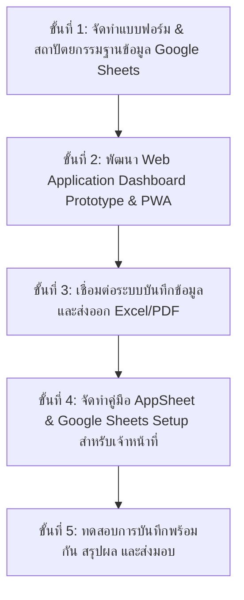

# แผนโครงการ: ระบบติดตามการใช้พลังงาน ไฟฟ้า และสารเคมี (Energy & Chemical Tracking System)

โครงการนี้จัดทำขึ้นเพื่อโรงงานการซ่อมและสนับสนุน เพื่อบันทึก ติดตาม และสรุปผลการใช้ไฟฟ้า พลังงาน และสารเคมี ทั้งรายวัน รายสัปดาห์ และรายเดือน ผ่านสมาร์ตโฟน (Android/iOS) และคอมพิวเตอร์เว็บเบราว์เซอร์ โดยใช้ฐานข้อมูลเดียวกัน รองรับการใช้งานพร้อมกันหลายคนโดยไม่มีค่าใช้จ่ายเซิร์ฟเวอร์

---

## 1. แนวทางการพัฒนาระบบ (System Architecture Options)

เพื่อให้ตรงตามเงื่อนไข **"ไม่ต้องเขียนโค้ดเพิ่มเติมในอนาคต ไม่มีค่าเช่าเซิร์ฟเวอร์ ใช้บัญชี Gmail/Google Workspace ได้"** เราเสนอ 2 แนวทางหลัก:

### แนวทางที่ 1: Google AppSheet + Google Sheets + Looker Studio (แนะนำสำหรับใช้งานจริงทันที)
* **ฐานข้อมูล (Database)**: Google Sheets (จัดเก็บข้อมูล ไฟฟ้า พลังงาน สารเคมี ประวัติการซ่อมบำรุง)
* **หน้ากรอกข้อมูล/แอปมือถือ (Mobile & Web App)**: Google AppSheet (สร้างแอปอัตโนมัติจาก Google Sheets รองรับทั้ง iOS, Android, Web Browser, สแกน QR/Barcode, ถ่ายรูปค่าน้ำมัน/มิเตอร์ไฟ)
* **ระบบสรุปผลและรายงาน (Dashboard & Export)**: Looker Studio (สรุปผลรายวัน/สัปดาห์/เดือน, กราฟเปรียบเทียบ, ส่งออกเป็น PDF/Excel)
* **จุดเด่น**: ไม่ต้องดูแลโค้ด เจ้าหน้าที่แก้ไขคอลัมน์และปรับเงื่อนไขได้เองผ่าน Google Sheets ใช้งานฟรีผ่าน Google Account

### แนวทางที่ 2: ระบบ Web Application (PWA Dashboard Prototype)
* **หน้าเว็บและระบบบริหารจัดการ (Responsive Web App)**: พัฒนาด้วย HTML5, CSS3 (Modern Glassmorphism & Dark Mode), Vanilla JavaScript, Chart.js, SheetJS (XLSX), และ jsPDF
* **การเชื่อมต่อ**: สามารถบันทึกข้อมูลแบบ Local Database / Sync ไปยัง Google Sheets ผ่าน Google Apps Script Web App API
* **จุดเด่น**: หน้าตาเมนูสวยงาม พรีเมียม ปรับแต่ง UI และ Workflow รายงานได้ตรงเป้าหมายที่สุด สามารถติดตั้งเป็น PWA บนมือถือได้เหมือนแอปแท้

---

## 2. โครงสร้างข้อมูลระบบ (Data Structure)

### 2.1 ตารางบันทึกการใช้ไฟฟ้า (Electricity Log)
* `ID` (รหัสรายการ)
* `Date_Time` (วัน-เวลาที่บันทึก)
* `Location_Zone` (โซน/อาคาร/แผนก เช่น โรงซ่อม 1, อาคารสนับสนุน)
* `Meter_Reading_kWh` (หน่วยมิเตอร์ไฟฟ้า kWh)
* `Peak_Demand_kW` (กำลังไฟฟ้าสูงสุด kW)
* `Recorded_By` (ผู้บันทึก/เจ้าหน้าที่)
* `Remarks_Photos` (หมายเหตุ / รูปถ่ายมิเตอร์)

### 2.2 ตารางบันทึกการใช้พลังงาน & เชื้อเพลิง (Energy & Fuel Log)
* `ID` (รหัสรายการ)
* `Date_Time` (วัน-เวลาที่บันทึก)
* `Energy_Type` (ประเภทพลังงาน เช่น น้ำมันดีเซล, แก๊ส LPG, ไบโอดีเซล, น้ำมันเบนซิน)
* `Quantity` (ปริมาณที่ใช้: ลิตร / กก.)
* `Equipment_Machine` (เครื่องจักร/รถซ่อมบำรุงที่ใช้)
* `Purpose` (วัตถุประสงค์การใช้งาน)
* `Recorded_By` (ผู้บันทึก)

### 2.3 ตารางบันทึกการใช้สารเคมี (Chemical Usage & Stock Log)
* `ID` (รหัสรายการ)
* `Date_Time` (วัน-เวลาที่บันทึก)
* `Chemical_Name` (ชื่อสารเคมี เช่น ทินเนอร์, น้ำมันล้างชิ้นส่วน, น้ำยาคูลแลนท์, ตัวทำละลาย)
* `Action_Type` (ประเภทรายการ: เบิกใช้ / รับเข้าสต็อก / ปรับปรุง)
* `Quantity` (ปริมาณ: ลิตร / กก. / ถัง)
* `Safety_Check` (การตรวจสอบความปลอดภัย / SDS)
* `Department_User` (หน่วยงานที่เบิกใช้)
* `Recorded_By` (ผู้บันทึก)

---

## 3. ฟีเจอร์หลักของระบบ (Core Features)

1. **Multi-Platform Access**: เข้าใช้งานได้ทั้งมือถือ Android / iOS (ผ่าน AppSheet / Web PWA) และ PC Web Browser
2. **Multi-User Realtime Input**: บันทึกข้อมูลพร้อมกันหลายคน ข้อมูลปรับอัปเดตแบบเรียลไทม์
3. **Smart Analytics Dashboard**: สรุปยอดการใช้และแนวโน้ม:
   - **รายวัน (Daily)**: เปรียบเทียบกับค่าเฉลี่ยปกติ แจ้งเตือนเมื่อมีการใช้ผิดปกติ (Anomaly Alert)
   - **รายสัปดาห์ (Weekly)**: กราฟแท่งเปรียบเทียบแต่ละแผนก/โซน
   - **รายเดือน (Monthly)**: สรุปยอดรวม ประเมินคาร์บอน footprint / ค่าใช้จ่ายเบื้องต้น
4. **Data Export**: ส่งออกข้อมูลในรูปแบบ **Excel (.xlsx)** สำหรับวิเคราะห์ต่อ และ **PDF** สำหรับทำรายงานเสนอผู้บังคับบัญชา
5. **Thai Language Native Support**: เมนู คำอธิบาย และแบบฟอร์มภาษาไทยทั้งหมด

---

## 4. แผนการดำเนินงาน (Implementation Steps)

### รายละเอียดการจัดทำไฟล์ระบบใน Workspace:
1. **`index.html`**: โครงสร้างหน้าเว็บแดชบอร์ดหลัก แบบฟอร์มบันทึกข้อมูล ไฟฟ้า พลังงาน สารเคมี
2. **`styles.css`**: ดีไซน์พรีเมียม สไตล์ Modern Dark/Glassmorphic UI สำหรับโรงงานอุตสาหกรรม การทำงานลื่นไหลบนมือถือและจอคอมพิวเตอร์
3. **`app.js`**: ระบบบันทึกข้อมูล, สรุปผลรายวัน/สัปดาห์/เดือน, คำนวณอัตโนมัติ, การสร้างกราฟ Chart.js, การส่งออกไฟล์ Excel/PDF
4. **`google-sheets-setup-guide.md`**: คู่มือภาษาไทยสำหรับเจ้าหน้าที่ในการนำแบบฟอร์มไปใช้กับ Google AppSheet / Google Sheets โดยไม่ต้องเขียนโค้ด

---

## 5. การตรวจสอบและทดสอบระบบ (Verification Plan)

### การทดสอบระบบอัตโนมัติ & จำลองการใช้งาน (Automated & Manual Tests)
- **การบันทึกข้อมูลมัลติยูสเซอร์**: ทดสอบฟอร์มบันทึกไฟฟ้า พลังงาน และสารเคมี
- **การคำนวณและสรุปผล**: ตรวจสอบความถูกต้องของกราฟและตารางสรุปผลรายวัน รายสัปดาห์ รายเดือน
- **การ Export ไฟล์**: ทดสอบการดาวน์โหลดไฟล์ Excel (.xlsx) และ PDF ว่าแสดงผลภาษาไทยถูกต้อง ไม่เพี้ยน
- **การใช้งานบนอุปกรณ์ต่างชนิด**: ทดสอบความสมบูรณ์ของ Responsive UI ทั้งบนมือถือ (Mobile View) และหน้าจอคอมพิวเตอร์ (Desktop View)

---

## 6. คำถามหรือข้อเสนอแนะเพิ่มเติม (Open Questions for User)

> [!NOTE]
> 1. ท่านต้องการให้จัดทำตัว **Web Dashboard Prototype (HTML/CSS/JS + Excel/PDF Export)** สำเร็จรูปในโปรเจกต์นี้ เพื่อทดลองใช้งานและดูรายงานสรุปผลทันทีเลยใช่หรือไม่?
> 2. มีชนิดสารเคมี หรือ ประเภทพลังงานเฉพาะของโรงงานที่ต้องการให้ใส่ในตัวเลือกเริ่มต้นของระบบเพิ่มเติมหรือไม่?
